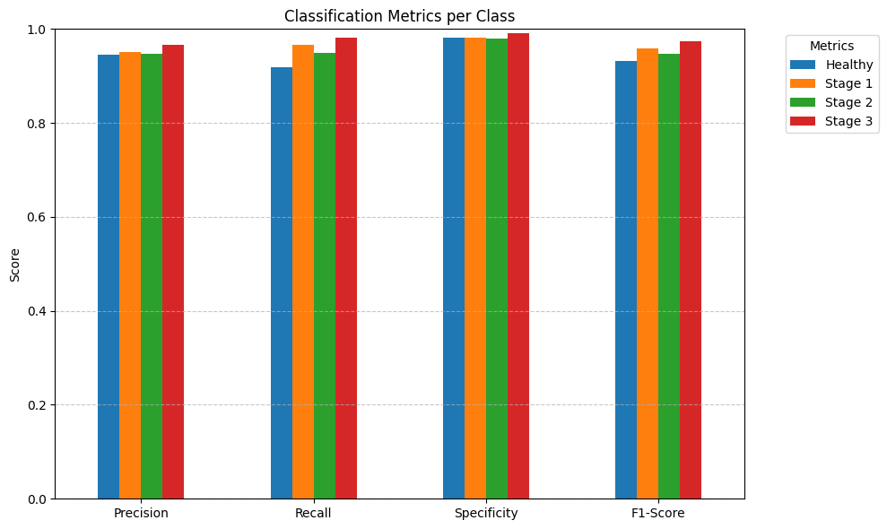
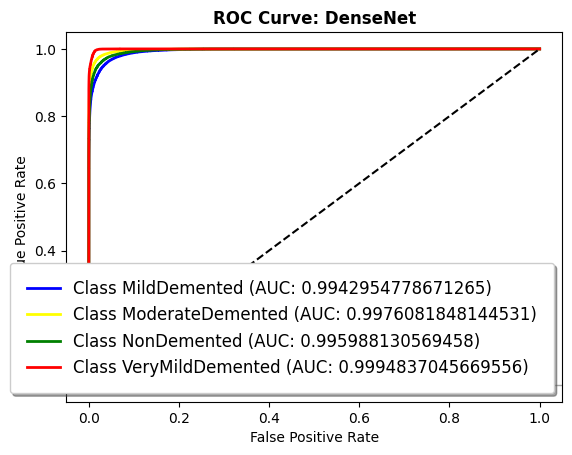
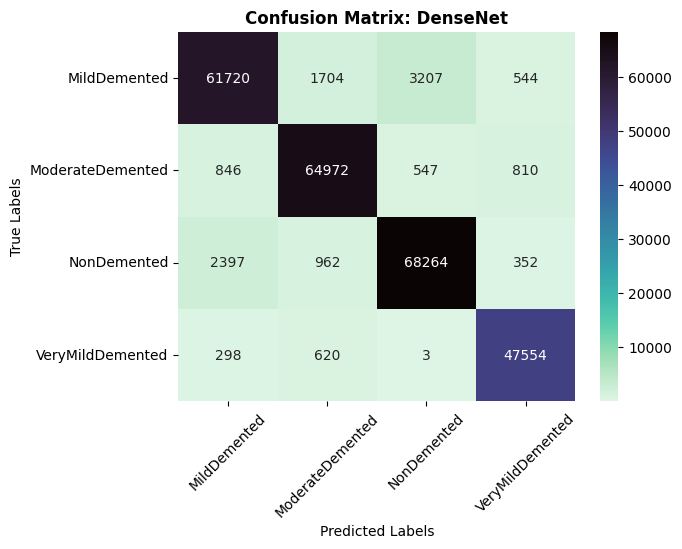
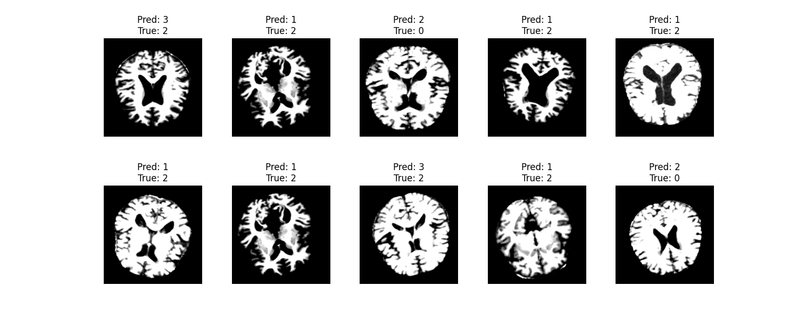

# Alzheimer MRI Classification with Transfer Learning

A deep learning project for classifying brain MRI images into four classes using transfer learning.  
The project was developed as part of the **Machine Learning** course at the University of Klagenfurt.

The main goal was not only to train a high-performing classifier, but also to compare different CNN backbones, understand how fine-tuning affects performance, and integrate the trained model into a small web application.

## My contribution

This was a team project. My main responsibility was the **machine learning part**, especially model selection, training, fine-tuning, and evaluation.

I worked mainly on:

- selecting and comparing transfer-learning architectures
- training **EfficientNet-B4, ResNet152, and DenseNet-169**
- experimenting with frozen and trainable model parameters
- introducing learning-rate scheduling and tuning the training setup
- evaluating the models using accuracy, loss, precision, recall, F1-score, confusion matrices, and ROC/AUC
- analyzing misclassifications and comparing the behavior of different architectures
- selecting the model configuration used in the final application

The dataset preparation and frontend/backend implementation were handled by other members of the team, with the final model integrated into the complete application.

## Dataset

We used the **Augmented Alzheimer MRI Dataset V2** from Kaggle.

| Property | Value |
|---|---:|
| Total images | 33,980 |
| Training images | 23,788 |
| Test images | 10,192 |
| Number of classes | 4 |
| Image resolution | 380 × 380 |

The preprocessing pipeline included resizing / center cropping, grayscale conversion, and custom normalization calculated from the dataset.

## Model development

We started with EfficientNet-B4 and gradually changed the training strategy after analyzing the learning curves and validation performance. We then compared the results with deeper architectures including ResNet152 and DenseNet-169.

The experiments showed a large difference between using a mostly frozen pretrained network and fully fine-tuning a model on the MRI dataset.

| Experiment | Reported accuracy |
|---|---:|
| EfficientNet-B4, frozen parameters | 67.16% |
| EfficientNet-B4 + scheduler | 70.49% |
| ResNet152, fine-tuned | 99.31% |
| DenseNet-169, fine-tuned | 99.69% |
| EfficientNet-B4, final fine-tuned experiment | **99.91%** |

The final reported test accuracy was **99.91%**, with **99.97% training accuracy**.

## Training setup

The main training configuration used in the later experiments was:

```text
Optimizer:       Adam
Learning rate:   0.001
Loss function:   Cross-Entropy Loss
Batch size:      32
Epochs:          25

Scheduler:       ReduceLROnPlateau
Factor:          0.5
Patience:        2
Threshold:       0.01
```

Training was performed across several environments, including Google Colab, a local RTX 3050 laptop GPU, and an RTX 4090 instance on Vast.ai.

## Evaluation

I did not want to evaluate the models based only on a single accuracy number. During training and comparison, we tracked:

- training and test loss
- training and test accuracy
- precision
- recall
- F1-score
- confusion matrices
- ROC/AUC
- examples of the most frequently confused images

This made it easier to compare the models beyond their headline accuracy and inspect where classification errors were occurring.









## Application architecture

The trained classifier was integrated into a simple web application.

```text
User uploads MRI image
        │
        ▼
     Vue.js
     frontend
        │
        ▼
     Node.js
     backend
        │
        ▼
 Python / PyTorch
 classification model
        │
        ▼
  Predicted class
        │
        ▼
 Result returned to UI
```

### Tech stack

**Machine learning**
- Python
- PyTorch
- Torchvision
- Torchmetrics
- NumPy
- Pandas
- Matplotlib

**Frontend**
- Vue.js
- Naive UI

**Backend**
- Node.js
- Python

## Repository structure

```text
.
├── Backend/
│   ├── ClassificationModel.py
│   ├── RequestManager.py
│   ├── app.js
│   ├── model_99_acc.pt
│   └── package.json
│
├── Frontend/
│   └── frontend/
│       ├── public/
│       ├── src/
│       ├── package.json
│       └── vue.config.js
│
├── Model/
│   └── ...
│
├── assets/
│   └── model_accuracy_comparison.png
│
├── .gitignore
└── README.md
```

## Team

The project was developed by five students:

- **Andrii Zhukov** — model selection and training
- **Dmytro Velychko** — model selection and training
- **Vladyslav Uhrik** — data selection and preparation
- **Egor Pichugin** — frontend and backend
- **Tykhin Biriukov** — frontend and backend

## Note

This repository contains a university machine learning project and is intended for educational and experimental purposes. The model was trained and evaluated on the selected dataset and should **not** be interpreted as a clinically validated diagnostic system.

---

## How to start:
1. Clone the repository to your local machine;
2. install all dependencies for Node.js and Vue.js with command `npm i`;
3. Open yout local host 8080;
4. Upload a x-ray image and see the result.
